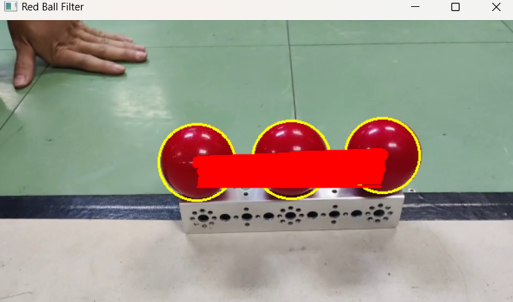
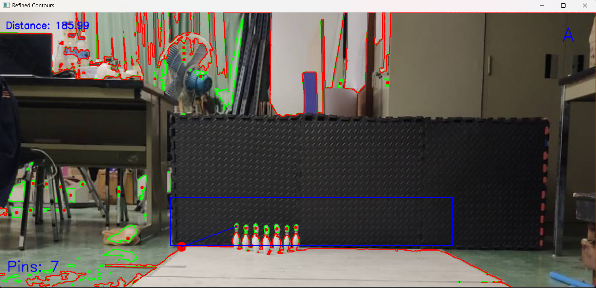
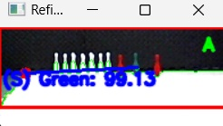
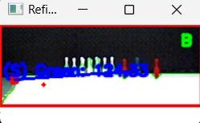
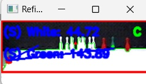
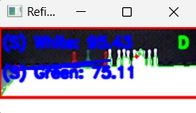
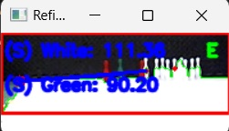
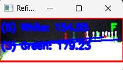

# CARC2024 - Robotics and AI 
(Pin Bowling Detection  Image processing contour & Map Features)
 
 

## Running Redball Centroid ##
<pre>python CARC_Redballstation.py --video ball-red-roboticsVision.mp4</pre> 
</img>

## Contour Image Egde Detection . . . ##

   

**## refine pin detection adjusted() :**
  

##  <pre>(1) pin detection: result -> A   </pre> 

##  <pre>(2) pin detection: result -> B  </pre> 

##  <pre>(3) pin detection: result -> C   </pre> 

##  <pre>(4) pin detection: result -> D  </pre> 

##  <pre>(5) pin detection: result -> E </pre> 

##  <pre>(6) pin detection: result -> F </pre> 

